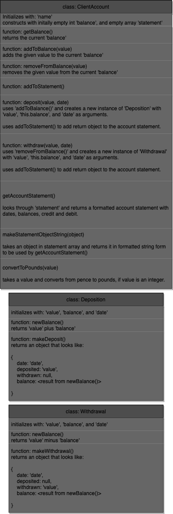

# bank-tech-test

### A Technical Test for Makers Academy

# Prerequisites

- Install [node.js](https://nodejs.org/en/)

# Setup

- Clone this repository.

```
git clone https://github.com/williamlines/bank-tech-test.git
```

- Install the dependencies.

```
cd bank-tech-test
npm install
```

- The only dependency for this code is 'jest', used for testing.

# Using the Code

- To start the app, make sure you are in the root directory and run:

```
npm start
```

- This will open node with a predefined class object 'account' to play around with using the instructions below.

# Instructions for use

## Making a Deposit

- To make a deposit, use (in node):

```
account.deposit(<amount to deposit in pence>, <date as string>)
```

for example:

```
account.deposit(1000, "01/01/2022")
```

## Making a withdrawal

- To make a withdrawal, use (in node):

```
account.withdraw(<amount to withdraw in pence>, <date as string>)
```

for example:

```
account.withdraw(1000, "01/01/2022")
```

### Note for Deposit and Withdrawal Functions

- These functions assume that you are inputting the value of money as an integer, in pence, e.g. 1000 will produce 10.00 on the statement.

- They also assume you input the date as a string in the format "DD/MM/YYYY", e.g. "01/02/2022" is equivalent to 1st February 2022.

- Finally, they also assume that you make deposits in chronological order. No tolerance for time travel.

## Account statement

- To view your current account statement use (in node):

```
account.getAccountStatement()
->
date || credit || debit || balance
03/01/2022 ||  || 400.00 || 97.00
02/01/2022 ||  || 3.00 || 497.00
01/01/2022 || 500.00 ||  || 500.00
```

- This will display your deposit and withdrawal history, as well as the change in balance over time.

# Running Tests

- To run all the tests at once, make sure you have exited node with ctrl + c, and in the root directory run:

```
jest
```

- To see coverage you may also append --coverage

```
jest --coverage
```

## Testing components

- To run the tests for only the Action class, run:

```
jest app/accountActions/Action.test.js
```

- To run the tests for only the ClientAccount class, run:

```
jest app/ClientAccount.test.js
```

# Notes

Included with this repository in the /docs file is bank.png, the drawio diagram used to plan the structure of the project. As the project evolved the class structure has shrunk to combine the classes 'Withdrawal' and 'Deposition' into one class, 'Action'.

